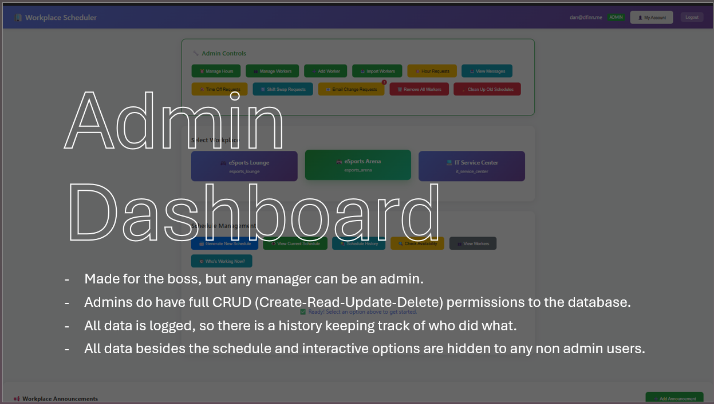
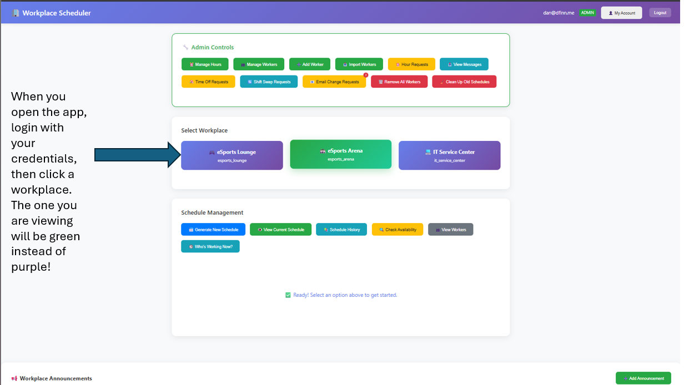
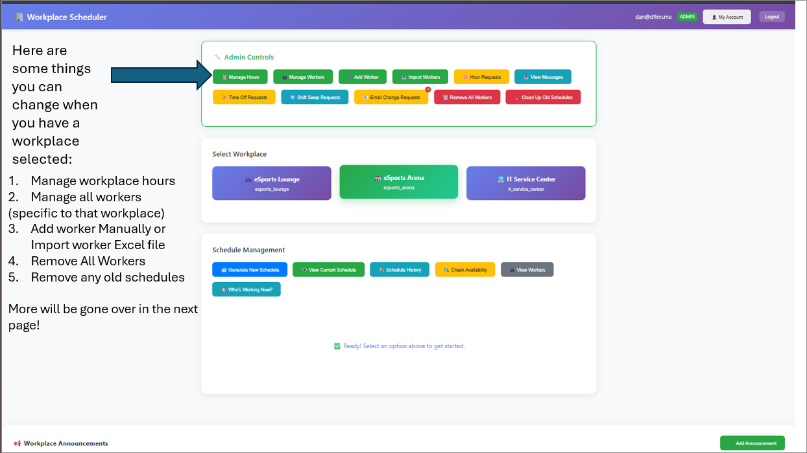
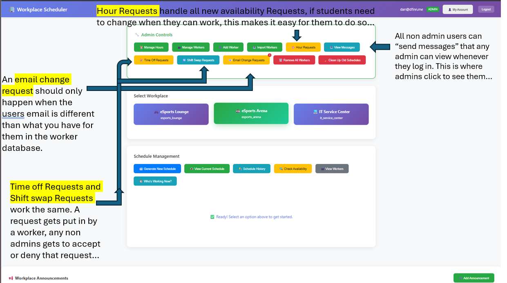
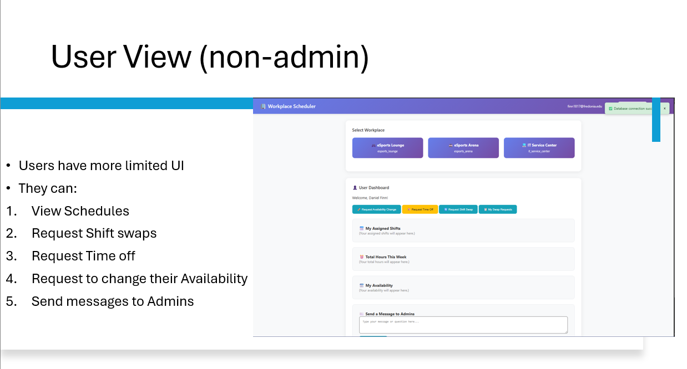

# Fredonia Workplace Scheduler Dashboard

An updated web app for managing workplaces, creating fair schedules, handling workers, and specific admin tasks at SUNY Fredonia.  
This was built for staff, admins, and student workers to centralize shift scheduling, availability, and communication all into one place. Before this, Everything was very chaotic (the way it was set up) in my opinion, only because things can be done so much easier nowadays!

---

## Table of Contents

- [Overview](#overview)
- [Features](#features)
- [Screenshots](#screenshots)
- [Tech Stack](#tech-stack)
- [Setup & Installation](#setup--installation)
- [Usage Guide](#usage-guide)
- [Database Structure](#database-structure)
- [Contributing](#contributing)
- [Credits](#credits)

---

## Overview

The **Fredonia Workplace Scheduler Dashboard** is a web-based tool designed to:
- Automate and optimize shift scheduling for multiple campus workplaces (eSports Lounge, eSports Arena, IT Service Center, etc.)
- Allow workers to view their schedules, request time off, and manage their availability
- Enable admins to manage users, approve requests, and ensure fair shift distribution

---

## Features

- **Handles 3 different Workplaces:** Manage multiple locations with separate schedules and workers from anywhere you have internet/service.
- **Automated Schedule Generation:** Fairly distributes shifts, prioritizes work-study requirements, and highlights unfilled shifts or any other errors with the schedule.
- **User Roles:** Admins and regular users with their own specific dashboards and permissions.
- **Availability & Time Off Requests:** Workers can submit availability changes and time off requests. Admins can review and approve or deny them all from the dashboard.
- **Shift Swap System:** Workers can request shift swaps, with admin oversight.
- **Announcements:** Admins can post important messages to all users.
- **Import/Export:** Handles bulk import/export worker data for easy access if needed.
- **Analytics:** Tracks worker hours, coverage gaps, and basically every stat needed for a workplace app.
- **Responsive UI:** Clean interface for desktop and mobile!

---

## Screenshots

<!-- Add screenshots here for visual appeal -->
- 
- 
- 
- 
- 
- 

---

## Tech Background

- **Frontend:** HTML, CSS, JavaScript (Vanilla, no framework)
- **Backend/Database:** Firebase Firestore (Cloud) - Connects with & uses 2 seperate joined databases
- **Hosting:** My domain through Github
- **Other:** Modern CSS (Flexbox, Grid), Responsive Design

---

## Setup & Installation

1. **Clone the repository**
   ```bash
   git clone https://github.com/<your-org>/Fredonia-Workplace-Dashboard.git
   cd Fredonia-Workplace-Dashboard
   ```

2. **Configure Firebase**
   - Create a Firebase project at [firebase.google.com](https://firebase.google.com/)
   - Enable **Cloud Firestore**
   - Modify/Add your Firebase config to the project’s JavaScript (see `dashboard.html` for the config section) - IMPORTANT - or you will never be able to use this as admin / for your own workplace

3. **Run Locally**
   - Open `dashboard.html` in your browser
   - (Optional) Use a local server

4. **Deploy**
   - Deploy to your preferred hosting

---

## Usage Guide

- **Admins:**  
  - Log in and select a workplace
  - Use the admin dashboard to manage workers, generate schedules, review requests, and post announcements
  - Import/export worker data if needed

- **Workers:**  
  - Create an account if you do not already have one
  - Log in to view your assigned shifts and total hours
  - Submit availability changes, time off, or shift swap requests
  - View workplace announcements and messages

---

## Database Structure

- **workplaces/**
  - **[workplace_name]/**
    - **workers/**
    - **schedules/**
    - **announcements/**
    - **admin_messages/**
    - **availability_requests/**
    - **hourRequests/**
    - **timeOffRequests/**
    - **shiftSwaps/**
- **users/**
  - **[users]/**
      - **email/**
      - **firstName/**
      - **lastName/**
      - **isAdmin/**
      - **loginTime/**
      - **password(encrypted without main key)/**
      - **phone (optional)/**

---

## Contributing
 
Please feel free to open an issue or submit a pull request for bug fixes, new features, or improvements!

---

## Credits

- Dan Finn [@finn1817](https://www.github.com/finn1817) - Creator / Programmer!
---

